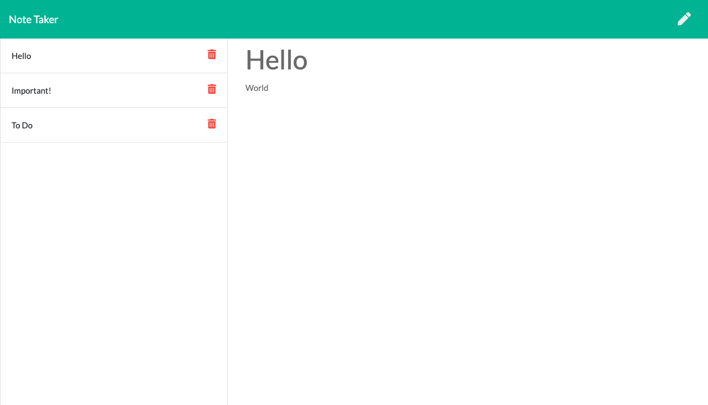

# Note-Taker


## Description

Dynamic note taking app run in the server which allows users to add, view and delete notes.

## Table of Contents

* [Installation](#installation)
* [Usage](#usage)
* [License](#license)
* [Contributing](#contributing)
* [Tests](#tests)
* [Questions](#questions)

## Installation

To install the necessary dependencies, run the following command:

```
npm i
```

## Usage

Once the dependencies are installed, run the following code in the Terminal or Git Bash to start the server:
```
node server.js
```
OR

Click [this link](https://ancient-thicket-67407.herokuapp.com/) to go to the deployed Heroku app!



## License

This project is licensed under the MIT license.

## Questions

If you have any questions about the repo, open an issue or want to discuss, contact me directly at anna.s.chong@gmail.com. You can find more of my work at [acho9138](https://github.com/acho9138/.).

## Credits

Thank you to the following resources to help make this app possible:

- The Coding Bootcamp at University of Sydney
- MDN
- Stack Overflow
- Node.js
- NPM
- Express.js